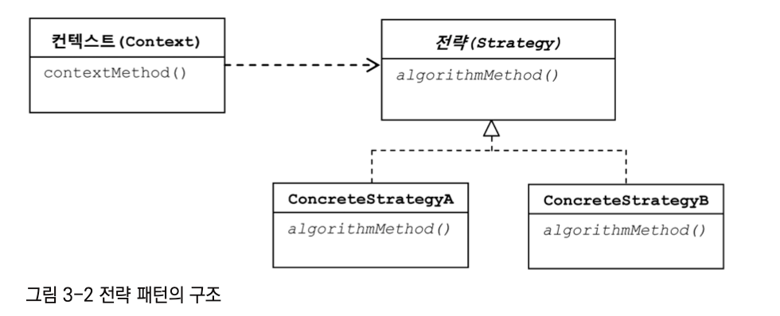
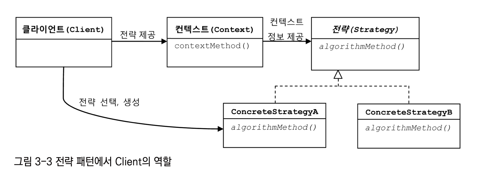

# 탬플릿
## `변경이 거의 일어나지 않으며 일정한 패턴으로 유지되는 특성을 가진 부분`을 `자유롭게 변경되는 성질을 가진 부분`으로부터 `독립`시켜서 활용하는 방법

## 예시: 템플릿 메서드 패턴
#### hook method (변경이 거의 없는 메서드) + abstract method (자유롭게 변경되는 메서드)

```
e.g.
public abstract class Super {
    // 기본 알고리즘 코드
    public void templateMethod() {
        hookMethod(); // 변경 잘 안되는 놈
        abstractMethod(); // 변경 잘되는 놈
    }
    
    public void hookMethod() {
        // 선택적으로 오버라이드 가능한 훅 메소드
    }

    public abstract void abstractMethod(); // 하위 클래스에서 반드시 구현해야하는 추상 메서드
}

public class Sub1 extends Super {
    // 상위 클래스의 메서드를 오버라이드 하거나 구현해서 기능을 확장
    // 다양한 확장 클래스를 만들 수 있다
    
    @Override
    public void hookMethod() {
	// 거의 할필요 없는데 해도되고 안해도되고
    }
    
    @Override
    public void abstractMethod() {
        // 무조건 해야함
    }
}
```


# 3.1. 다시보는 초난감 DAO

## 기존 deleteAll 메서드의 문제점
  
서버에서는 일반적으로 제한된 개수의 DB connection을 생성해서 재사용가능한 pool로 관리함

close 해서 다시 pool로 돌려줘야 (리소스 반환) 다음 커넥션에 재사용 가능

에러가 나더라도 제대로 close 할 수 있도록 `예외처리` 필요

그래서 일단 ***무식한 방법***으로 예외 처리 시작

---

## try/catch/finally 적용
  
문제점:

ps에서 에러가 터졌는지 c에서 에러가 터졌는지 모름

에러가 터진 시점에 따라 ps와 c의 null 여부가 달라짐

일단은 getCount()메서드도 마찬가지로 try catch 떡칠로 생성

# 3.2 변하는 것과 변하지 않는 것

앞에서 본 무식한 방법의 문제점

- `코드 중복` + `인덴트` -> 실수 유발 가능성 높아짐

`변하지 않는 것`과 `변하는 것`을 분리해보자!

## 템플릿 메소드 패턴 적용!

(`변하지 않는 부분`은 `슈퍼클래스`에 두고 `변하는 부분`은 `추상 메소드`로 정의해둬서 
`서브클래스`에서 오버라이드하여 새롭게 정의해 쓰도록 하는 것)

문제점:
- DAO 로직마다 상속을 통해 `새로운 클래스`를 생성해야함 (add, deleteAll, get, count, 총 4개)
- 서브 클래스들이 이미 클래스 레벨에서 컴파일 시점에 이미 관계가 결정되어있다

## 전략 패턴 적용!

템플릿 메서드 패턴보다 `유연`하고 `확장성`이 뛰어남

서브클래스들에 의존하지않고 `인터페이스를 통해서만 의존`하도록



### 변하지 않는 부분 (context) 의 흐름

- DB 커넥션 가져오기 (1)
- PreparedStatement를 만들어줄 외부 기능 호출하기 (2)
- 전달받은 PreparedStatement 실행하기 (3)
- 예외가 발생하면 이를 다시 메소드 밖으로 던지기 (4)
- 모든 경우에 만들어진 PreparedStatement와 Connection을 적절히 닫아주기 (5)

***(2) -> 전략 (외부기능)이 들어가야하는 부분***

### DI 적용을 위한 클라이언트/컨텍스트 분리



잠시 자동차 경주 예시:

- 클라이언트: RacingGame (or RacingCarController)
- 컨텍스트: Car
- 전략: MoveStrategy (NumberGenerator) 
  - RandomNumberGenerator, FixedNumberGenerator

여기서 전략 오브젝트의 `생성`과 컨텍스트로의 `전달(주입)`을 담당하는 책임을 분리시킨 것이 `ObjectFactory`.

그리고 이를 일반화 시킨 개념이 `Dependency Injection (DI)`

---

메서드 파라미터로 StatementStrategy 인터페이스를 구현한 구현체를 집어 넣어줘야함

이제 stmt 구현체가 뭔지는 모르지만, 알 필요없음. 그냥 PS 생성이 필요한 시점에 호출해서 사용만 하면 됨

### 마이크로 DI
- IOC 컨테이너의 ***도움없이*** 코드 내에서 적용한 경우
- e.g. 우리가 자동차 경주 미션에서 했던 DI

# 3.3 JDBC 전략 패턴의 최적화

이제 `변하지 않는 부분`과 `자주 변하는 부분`이 `전략 패턴`을 사용해서 분리됨

DAO의 메서드들은 `클라이언트`가 됨 (jdbcContextWithStatementStrategy에 구체적인 전략을 제공)

- 컨텍스트: JDBC작업 흐름 (연결 -> 쿼리 실행 -> 연결 끊기)
- 전략: PreparedStatement (query) 생성 (어떤 쿼리를 날릴 것인가)

## 3.3.1 전략 클래스의 추가 정보

add 메서드에도 전략패턴을 적용해보자

## 3.3.2 전략과 클라이언트의 동거

문제점:
1. DAO 메서드 마다 `새로운 StatementStrategy 구현 클래스`를 만들어야 함 -> 클래스 파일 개수 너무 많아짐
2. addStatement 처럼 필요한 부가정보 (User)가 있는 경우 번거롭게 `생성자`와 `인스턴스 변수` 만들어줘야함

더 개선해보자!

### 로컬 클래스 (메소드 레벨에 정의되는 내부 클래스)

add 메서드안에 addStatement 클래스를 로컬 클래스로서 넣어줌

장점:
- 클래스 파일이 하나 줄어듬
- 생성로직을 메서드 안에서 바로 볼 수 있음
- 따로 클래스를 구현해 주었을 때랑 달리 user에 바로 접근 가능함

### 익명 내부 클래스

add 메서드 안에서만 있는 클래스 이므로 `이름이 필요없음` -> 익명클래스로 만들자

add 와 deleteAll에 적용해보자